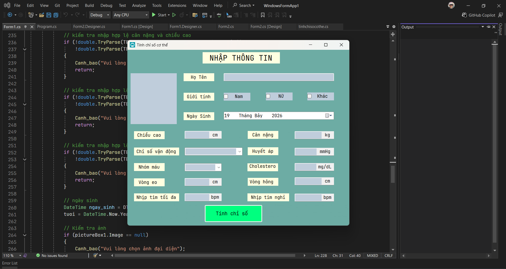
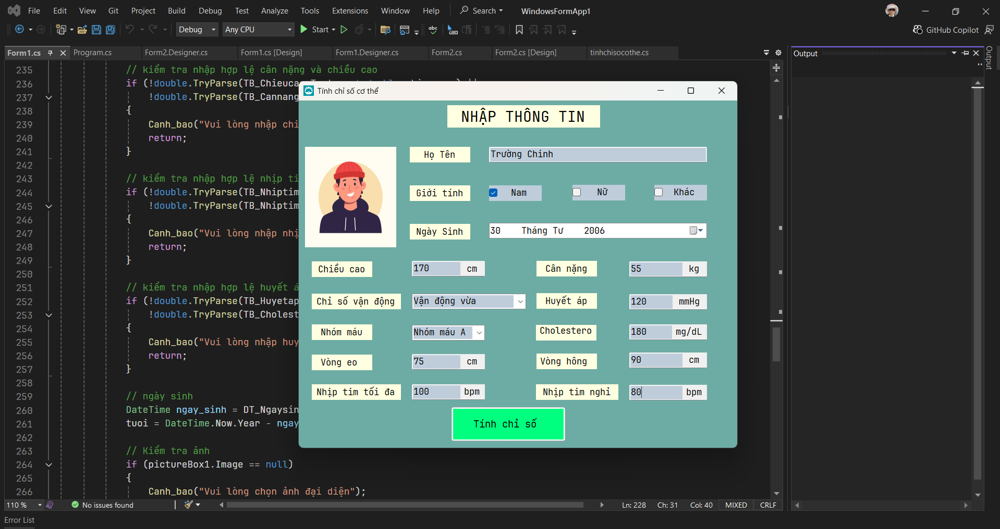
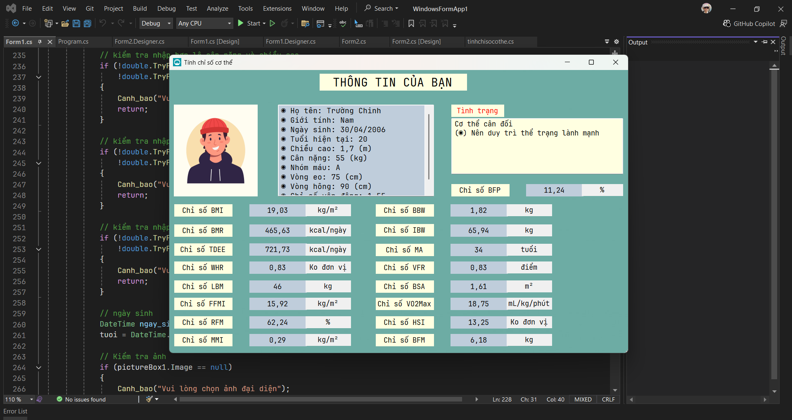

# Bodyindex GUI

## Giới thiệu 
Đây là chương trình C# Winform đầu tay của mình, chương trình tính chỉ số cơ thể cơ bản như BMI, BMR, TDEE, ... với giao diện trực quan tương tự như những app tính chỉ số sức khỏe khác. 

Mục tiêu dự án này:

- Làm quen với C# và WinForms.
- Tìm hiểu cách thiết kế giao diện bằng Toolbox.
- Thực hành đặt tên control, lựa chọn màu sắc và tùy chỉnh các thuộc tính của Button, Label, TextBox,...
- Làm việc với dữ liệu nhập từ người dùng và hiển thị kết quả.
- Kiểm tra dữ liệu đầu vào và cảnh báo khi người dùng nhập thiếu hoặc sai thông tin.

---

## Demo hình ảnh 

---

## Tác giả
**Nguyễn Trường Chinh (NTC++)** 
**GitHub:** [https://github.com/trgchinhh](https://github.com/trgchinhh)

---

> 📌 Dự án nhỏ được phát triển với mục đích học tập và nghiên cứu. Mọi góp ý và đóng góp đều được hoan nghênh.
